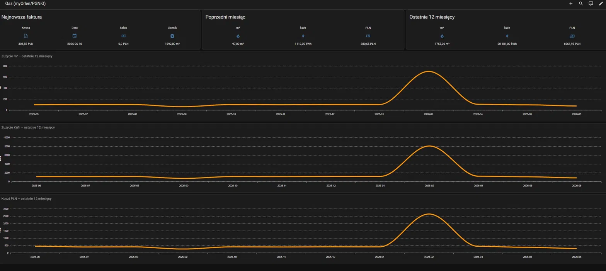
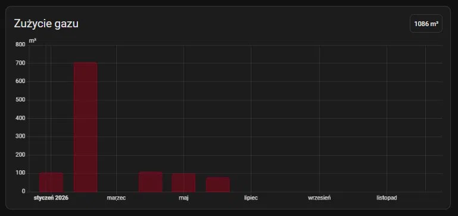

# ORLEN Gas — Home Assistant Integration

[](https://hacs.xyz)

Home Assistant integration for gas consumption data from myORLEN account (formerly eBOK PGNiG).

Data is fetched from the unofficial myORLEN API and exposed as sensors, chart data, and Energy Dashboard statistics — updated automatically every 24 hours.

---

## Screenshots

### Dashboard panel


### Energy Dashboard — Gas tab


---

## Requirements

- Home Assistant 2025.1.0 or newer
- Active account at [ebok.myorlen.pl](https://ebok.myorlen.pl)

---

## Installation via HACS

1. Open HACS → **Integrations** → menu (⋮) → **Custom repositories**
2. Add URL: `https://github.com/HACS9/home-assistant-orlen-gas`
3. Category: **Integration**
4. Click **Add**, then install **ORLEN Gas**
5. Restart Home Assistant

---

## Configuration

1. Go to **Settings → Devices & Services → Add Integration**
2. Search for **ORLEN Gas**
3. Enter your myORLEN e-mail and password
4. Click **Submit**

Authentication happens once. The token is stored in memory and renewed automatically when it expires.

---

## Sensors

### Account & billing

| Entity | Description | Unit |
|---|---|---|
| `sensor.orlen_gas_saldo` | Account balance (negative = overdue, positive = overpayment) | PLN |
| `sensor.orlen_gas_ostatnia_faktura` | Latest invoice amount | PLN |
| `sensor.orlen_gas_data_ostatniej_faktury` | Latest invoice end date | — |
| `sensor.tech_orlen_gas_stan_licznika` | Meter reading (latest real reading) | m³ |

### Annual totals

| Entity | Description | Unit |
|---|---|---|
| `sensor.orlen_gas_zuzycie_roczne` | Total consumption — last 12 months | m³ |
| `sensor.tech_orlen_gas_zuzycie_roczne_kwh` | Total consumption — last 12 months | kWh |
| `sensor.tech_orlen_gas_koszt_roczny` | Total cost — last 12 months | PLN |

### Monthly consumption — last 12 months

Three parallel sets of sensors, one per month (offset 0 = current, 1 = previous, 2–11 = older):

| Entity pattern | Description | Unit |
|---|---|---|
| `sensor.orlen_gas_biezacy_miesiac` / `_poprzedni_miesiac` / `_miesiac_X` | Consumption m³ | m³ |
| `sensor.tech_orlen_gas_kwh_biezacy_miesiac` / `_poprzedni_miesiac` / `_kwh_miesiac_X` | Consumption kWh | kWh |
| `sensor.tech_orlen_gas_koszt_biezacy_miesiac` / `_poprzedni_miesiac` / `_koszt_miesiac_X` | Cost | PLN |

Each monthly sensor has a `month` attribute (e.g. `2025-11`) and m³ sensors additionally have `is_settlement: true` when the month was detected as a settlement period.

### Chart data sensor

| Entity | Description |
|---|---|
| `sensor.tech_orlen_gas_wykres_12_miesiecy` | JSON attribute `data` — list of last 12 months with `month`, `m3`, `kwh`, `pln` fields |

Use this sensor as a data source for [ApexCharts Card](https://github.com/RomRider/apexcharts-card) — see Dashboard section below.

---

## Energy Dashboard

The integration automatically writes monthly gas consumption statistics to the Home Assistant recorder database on every update. This populates the **Energy → Gas** tab with historical data going back to the earliest available invoice — no waiting required.

To enable:

1. Go to **Settings → Energy → Gas consumption**
2. Select **ORLEN Gas zużycie m³** (statistic ID: `orlen_gas:gas_consumption_m3`)
3. Save

---

## Dashboard panel

The panel below can be added as a new dashboard in Home Assistant. It requires [ApexCharts Card](https://github.com/RomRider/apexcharts-card) installed via HACS.

**Important notes on ApexCharts Card:**
- `data_generator` only works in **Panel view** with `vertical-stack` — it crashes in Section view and `horizontal-stack`
- Do not use `EVAL` in `dataLabels` or `tooltip` — it freezes Home Assistant

<details>
<summary>Dashboard YAML (click to expand)</summary>

```yaml
views:
  - type: panel
    path: gaz-myorlen-pgnig
    title: Gaz (myOrlen/PGNiG)
    icon: mdi:gas-burner
    cards:
      - type: vertical-stack
        cards:

          - type: horizontal-stack
            cards:
              - type: glance
                show_name: true
                show_icon: true
                title: Najnowsza faktura
                entities:
                  - entity: sensor.orlen_gas_ostatnia_faktura
                    name: Kwota
                  - entity: sensor.orlen_gas_data_ostatniej_faktury
                    name: Data
                  - entity: sensor.orlen_gas_saldo
                    name: Saldo
                  - entity: sensor.tech_orlen_gas_stan_licznika
                    name: Licznik

              - type: glance
                show_name: true
                show_icon: true
                title: Poprzedni miesiąc
                entities:
                  - entity: sensor.orlen_gas_poprzedni_miesiac
                    name: m³
                  - entity: sensor.tech_orlen_gas_kwh_poprzedni_miesiac
                    name: kWh
                  - entity: sensor.tech_orlen_gas_koszt_poprzedni_miesiac
                    name: PLN

              - type: glance
                show_name: true
                show_icon: true
                title: Ostatnie 12 miesięcy
                entities:
                  - entity: sensor.orlen_gas_zuzycie_roczne
                    name: m³
                  - entity: sensor.tech_orlen_gas_zuzycie_roczne_kwh
                    name: kWh
                  - entity: sensor.tech_orlen_gas_koszt_roczny
                    name: PLN

          - type: custom:apexcharts-card
            header:
              show: true
              title: Zużycie m³ – ostatnie 12 miesięcy
              show_states: false
            apex_config:
              chart:
                height: 280
                type: bar
              plotOptions:
                bar:
                  borderRadius: 4
                  columnWidth: 70%
              xaxis:
                type: category
              yaxis:
                title:
                  text: m³
                decimalsInFloat: 0
              legend:
                show: false
            series:
              - entity: sensor.tech_orlen_gas_wykres_12_miesiecy
                name: m³
                data_generator: |
                  const data = entity.attributes.data || [];
                  return data
                    .sort((a, b) => a.month.localeCompare(b.month))
                    .map(d => ({ x: d.month, y: d.m3 }));

          - type: custom:apexcharts-card
            header:
              show: true
              title: Zużycie kWh – ostatnie 12 miesięcy
              show_states: false
            apex_config:
              chart:
                height: 280
                type: bar
              plotOptions:
                bar:
                  borderRadius: 4
                  columnWidth: 70%
              xaxis:
                type: category
              yaxis:
                title:
                  text: kWh
                decimalsInFloat: 0
              legend:
                show: false
            series:
              - entity: sensor.tech_orlen_gas_wykres_12_miesiecy
                name: kWh
                data_generator: |
                  const data = entity.attributes.data || [];
                  return data
                    .sort((a, b) => a.month.localeCompare(b.month))
                    .map(d => ({ x: d.month, y: d.kwh }));

          - type: custom:apexcharts-card
            header:
              show: true
              title: Koszt PLN – ostatnie 12 miesięcy
              show_states: false
            apex_config:
              chart:
                height: 280
                type: bar
              plotOptions:
                bar:
                  borderRadius: 4
                  columnWidth: 70%
              xaxis:
                type: category
              yaxis:
                title:
                  text: PLN
                decimalsInFloat: 0
              legend:
                show: false
            series:
              - entity: sensor.tech_orlen_gas_wykres_12_miesiecy
                name: PLN
                data_generator: |
                  const data = entity.attributes.data || [];
                  return data
                    .sort((a, b) => a.month.localeCompare(b.month))
                    .map(d => ({ x: d.month, y: d.pln }));
```

</details>

---

## Notes

**Settlement periods** — myORLEN bills gas based on estimates between real meter readings. After a real reading, a settlement invoice is issued that may cover several months of consumption at once. The integration detects this automatically: if a month's value exceeds 3× the average, it is flagged as `is_settlement: true`.

**Meter reading sensor** — `sensor.tech_orlen_gas_stan_licznika` uses only real meter readings (`Receiver` and `RealCorrect` types). Estimated readings are ignored.

**Data refresh** — every 24 hours.

**API limitations** — consumption statistics and chart endpoints from the myORLEN API currently return HTML instead of data. All consumption data in this integration is derived from invoice records.

---

## License

MIT
